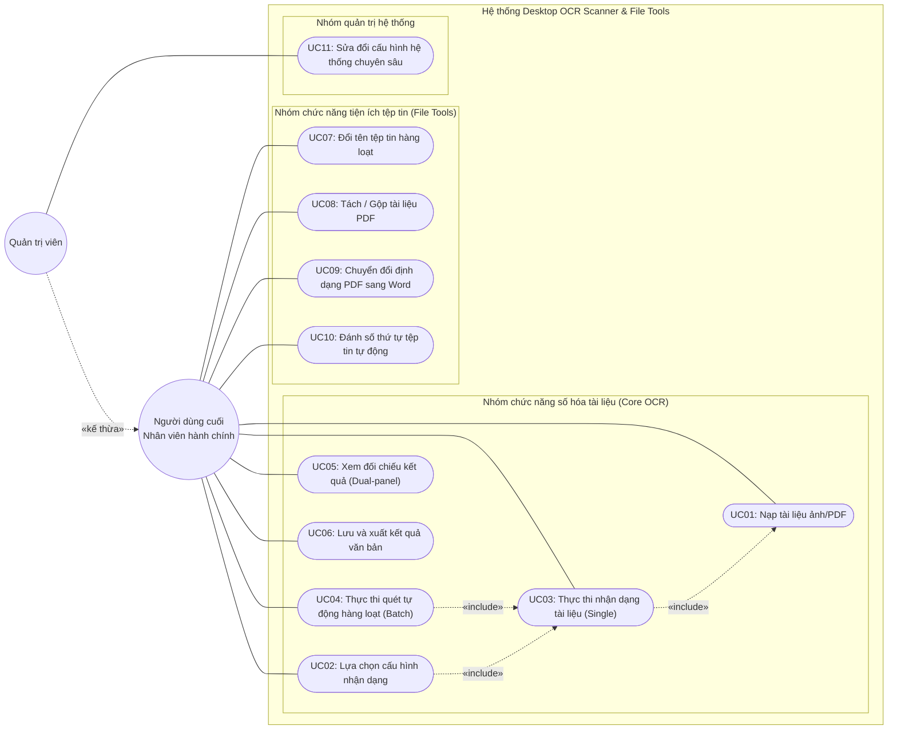

# 2.3.1. Biểu đồ Usecase tổng quát

Trong hệ thống phần mềm, Biểu đồ Use Case (Ca sử dụng) đóng vai trò định nghĩa các chức năng mà hệ thống cung cấp từ góc nhìn của người sử dụng, cũng như chỉ ra các đối tượng (Tác nhân - Actor) nào được phép tương tác với các chức năng đó. Khác với biểu đồ luồng hoạt động hay trình tự xử lý, biểu đồ Use Case không quan tâm đến trình tự thực hiện hay logic hệ thống bên trong, mà chỉ tập trung trả lời câu hỏi: **"Ai làm gì với hệ thống?"**.

### 1. Định nghĩa các Tác nhân (Actors)

Hệ thống OCR Scanner & File Tools hướng tới hai nhóm đối tượng người dùng chính:

- **Người dùng cuối (Nhân viên hành chính):** Là đối tượng sử dụng trực tiếp các chức năng của phần mềm để phục vụ công việc hàng ngày như số hóa tài liệu, nạp file, đổi tên hàng loạt, trích xuất văn bản... Họ tương tác với giao diện đồ họa trực quan (GUI) và không cần quan tâm đến các tham số kỹ thuật máy học phức tạp bên dưới.
- **Quản trị viên (Admin/Developer):** Là những người có hiểu biết về kỹ thuật, được cấp quyền truy cập vào các cấu hình hệ thống chuyên sâu (như sửa file `config.json` hoặc bật Admin Mode) để tinh chỉnh thông số các mô hình AI, quản lý bộ nhớ hoặc cập nhật bộ từ điển. _(Lưu ý: Quản trị viên cũng có toàn quyền thực hiện mọi chức năng của Người dùng cuối)._

_(Lưu ý: Ở góc độ tương tác hướng người dùng, các mô hình Trí tuệ nhân tạo (DocTR, PaddleOCR, ProtonX Nano) không đóng vai trò là Tác nhân chủ động thao tác vào hệ thống, mà chúng là các thành phần xử lý dịch vụ (Backend Services) được hệ thống gọi đến để phục vụ mục đích của Người dùng. Vì vậy, chúng không xuất hiện như một Actor trong biểu đồ Use Case này)._

### 2. Biểu đồ Use Case tổng quát

Dưới đây là biểu đồ Use Case thể hiện sự tương tác giữa các Tác nhân và các nhóm chức năng (Use case) cốt lõi của phần mềm.

### 3. Diễn giải các Use case chính

**Nhóm chức năng số hóa tài liệu (Core OCR):**

- **UC01: Nạp tài liệu ảnh/PDF**: Cho phép người dùng kéo thả hoặc chọn tệp tin cần số hóa từ máy tính vào phần mềm.
- **UC02: Lựa chọn cấu hình nhận dạng**: Người dùng có thể chọn Engine nhận dạng (DocTR, PaddleOCR, EraX) và quyết định bật/tắt các bộ hậu xử lý AI (như ProtonX Nano hay SymSpell).
- **UC03: Thực thi nhận dạng tài liệu (Single)**: Kích hoạt quá trình chạy các mô hình AI để đọc và trích xuất văn bản từ tệp tin đang mở trên giao diện.
- **UC04: Thực thi quét tự động hàng loạt (Batch)**: Người dùng cung cấp thư mục chứa nhiều ảnh/PDF, hệ thống tự động lặp qua toàn bộ và thực thi trích xuất (gọi UC03 cho từng tệp tin), lưu kết quả liên tục mà không cần người dùng can thiệp thủ công cho mỗi tệp.
- **UC05: Xem đối chiếu kết quả (Dual-panel)**: Người dùng xem trực quan và so sánh văn bản kết quả hiển thị ở khung bên phải với tài liệu ảnh gốc ở khung bên trái.
- **UC06: Lưu và xuất kết quả văn bản**: Người dùng thao tác chỉnh sửa (nếu cần) trên kết quả máy trả về và ra lệnh xuất kết quả thành tệp `.txt` hoặc sao chép vào bộ nhớ đệm.

**Nhóm chức năng tiện ích tệp tin (File Tools):**

- **UC07: Đổi tên tệp tin hàng loạt**: Cho phép người dùng thiết lập các quy tắc nâng cao (tiền tố, hậu tố, biểu thức chính quy Regex) để hệ thống tự động đổi tên cho hàng ngàn tệp tin nhằm mục đích chuẩn hóa dữ liệu trước khi quét OCR hoặc lưu trữ.
- **UC08: Tách / Gộp tài liệu PDF**: Hỗ trợ bóc tách một tệp PDF công văn lớn thành nhiều trang nhỏ, hoặc ngược lại, gộp nhiều tệp văn bản rời rạc thành một bộ hồ sơ duy nhất.
- **UC09: Chuyển đổi định dạng PDF sang Word**: Cung cấp chức năng cho phép chuyển đổi một tài liệu PDF sang dạng tệp văn bản thao tác dễ dàng như Microsoft Word (`.docx`).
- **UC10: Đánh số thứ tự tệp tin tự động**: Tự động chèn số thứ tự (dạng 001, 002...) vào tiền tố hoặc hậu tố tên các tệp tin trong thư mục.

**Nhóm quản trị hệ thống:**

- **UC11: Sửa đổi cấu hình hệ thống chuyên sâu**: Cấp quyền cho Quản trị viên can thiệp vào các tham số ẩn của phần mềm thông qua tệp `config.json` (VD: thay đổi giới hạn VRAM, đường dẫn tải từ điển nội bộ) mà giao diện đồ họa không hiển thị ra cho người dùng thông thường.
